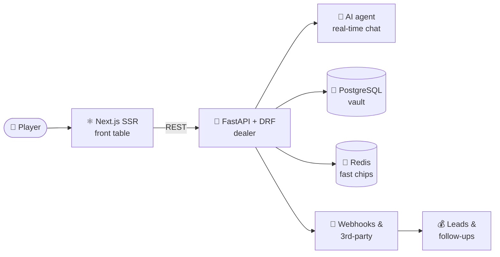

<!-- ═══════════════════════════  🎰 LOBBY  ═══════════════════════════ -->
<div align="center">


<br/>

```
╔═══════════════════════════════════════════════╗
║     ★ ★ ★   B E K E S H   C A S I N O   ★ ★ ★  ║
╠═══════════════════════════════════════════════╣
║                                               ║
║        ┌───────┐  ┌───────┐  ┌───────┐        ║
║        │  🐍   │  │  ⚛️   │  │  🐳   │        ║
║        │PYTHON │  │ REACT │  │DOCKER │        ║
║        └───────┘  └───────┘  └───────┘        ║
║                                               ║
║          💥  J A C K P O T   H I T  💥         ║
║        full-stack combo · pays both ends       ║
╚═══════════════════════════════════════════════╝
```

<a href="https://www.linkedin.com/in/YOUR_LINKEDIN/"></a>
<a href="mailto:YOUR_EMAIL"></a>


</div>

---

## 🃏 Player card

| | |
|---|---|
| **Player** | Oleksandr Bekesh |
| **Class** | Python Developer & Full-Stack Developer |
| **Home table** | Lviv, Ukraine 🇺🇦 · remote-ready |
| **Hours on the floor** | 6+ years |
| **Signature move** | Builds the backend *and* the frontend that plays on it |
| **Looking for** | Python · Full-Stack · React/TypeScript seats |
| **House rule** | Async remote teams, clean PRs, no bluffing in code reviews |

---

## 💎 Paytable

> Every stack I play, and what it pays out.

| Symbols | Combo | Payout |
|:---:|---|---|
| 🐍 🐍 🐍 | **Python · Django · FastAPI** | REST APIs & microservices that hold under load |
| 🔷 🔷 🔷 | **DRF · Celery · Redis** | Background jobs, caching, fast responses |
| 🐘 🐘 🐘 | **PostgreSQL** | Data that never goes missing from the pot |
| ⚛️ ⚛️ ⚛️ | **React · TypeScript · Next.js** | SSR/SSG interfaces tuned for speed & SEO |
| 🎨 🎨 🎨 | **Tailwind · Zustand/Redux** | Clean UI, predictable state |
| 🐳 🐳 🐳 | **Docker · GitHub Actions · Linux** | CI/CD — every deploy lands on the table |
| 🃏 🃏 🃏 | **Git · Postman · VS Code · Jira** | Wild cards that fit into any team |
| 🐍 ⚛️ 🐳 | **FULL-STACK COMBO** | 💰 **JACKPOT** — schema → API → UI → prod |

<div align="center">


<br/>


</div>

---

## 🏆 Tournament history

```
┌────────────────────────────────────────────────────────────────┐
│  LEVEL 4 ▸ dZENcodee                    Sep 2023 — Jul 2026    │
│  🎖 Python Full-Stack Developer · product company · remote      │
│  ├─ Led backend on Django, FastAPI & DRF                        │
│  ├─ Designed scalable REST APIs for React/TS/Next.js fronts     │
│  ├─ PostgreSQL + Redis, everything containerized in Docker      │
│  ├─ Automated deploys through GitHub Actions CI/CD              │
│  └─ SSR/SSG in Next.js for performance & SEO                    │
├────────────────────────────────────────────────────────────────┤
│  BONUS ROUND ▸ Lviv Polytechnic · M.Sc. Computer Science       │
│  🎓 Sep 2022 — Jan 2024 · architecture, distributed systems     │
├────────────────────────────────────────────────────────────────┤
│  LEVEL 2 ▸ Uvik Software                Sep 2019 — Aug 2023    │
│  🎖 Python Full-Stack Developer · outsourcing · global clients  │
│  ├─ Backend services & REST APIs on Python/Django               │
│  ├─ React/TypeScript UI components, PostgreSQL                  │
│  └─ CI/CD, Agile sprints, code reviews, shipped on schedule     │
├────────────────────────────────────────────────────────────────┤
│  LEVEL 1 ▸ Lviv Polytechnic · B.Sc. Computer Science           │
│  🎓 Sep 2018 — Jun 2022 · first bet placed on Python & JS       │
└────────────────────────────────────────────────────────────────┘
```

---

## 🎲 Featured game — **MagicForm.ai**

> AI-powered chatbot platform that automates customer communication for businesses.



| 🎯 Round | Play |
|---|---|
| **Deal** | RESTful APIs with FastAPI + Django REST Framework |
| **Draw** | AI agent layer for real-time conversations |
| **Show** | React/Next.js frontend with SSR |
| **Bank** | PostgreSQL storage, Redis caching |
| **Cash out** | Whole stack deployed via Docker, webhooks for lead gen |

---

## 📈 Live table stats

<div align="center">


</div>

---

## 📋 House rules

```
♠  The API contract is the deck — nobody shuffles it mid-game.
♥  Untested code doesn't get a seat at the table.
♦  Own the whole hand: migration → endpoint → component → deploy.
♣  Async by default. Clear tickets, clear PRs, clear docs.
```

---

<div align="center">

### 🎰 SPIN TO CONNECT

```
   [ 🐍 ]  [ ⚛️ ]  [ 🤝 ]   ◀── you're one pull away
```

Hiring for Python, Full-Stack or React/TypeScript?<br/>
**The seat is open. Deal me in.**


<sub>♠ ♥ ♦ ♣ · no bluffs, only deploys · ♣ ♦ ♥ ♠</sub>

</div>
